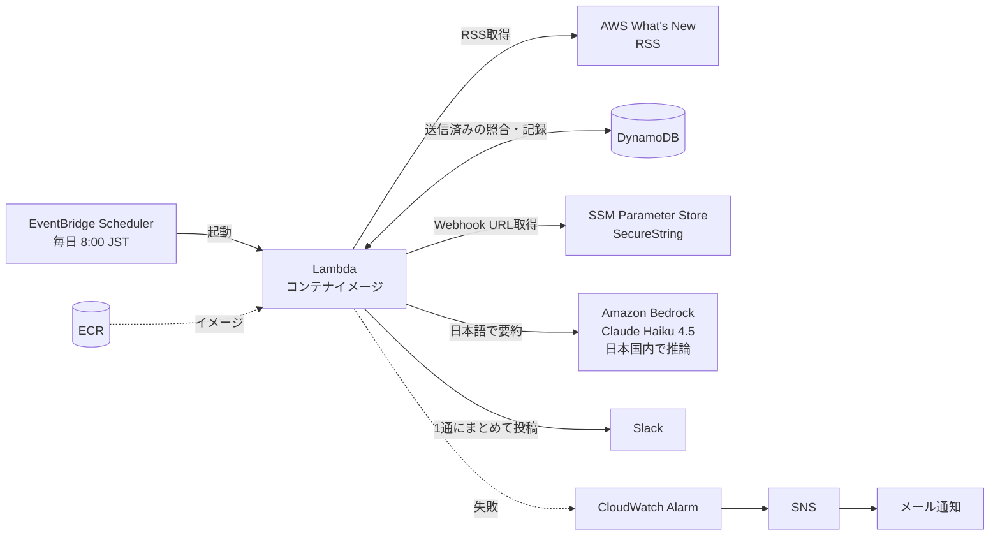

# 🛰️ AWS News Summarizer

AWS の新着情報（What's New）を毎朝自動で取得し、**まだ送っていない記事だけ**を Amazon Bedrock で**日本語に要約**して、Slack に1通にまとめて届けるサーバーレスシステムです。インフラはすべて Terraform で管理しています。

> **目的**：大量に出る AWS のアップデートを、毎朝1回、日本語の短い要約で受け取る。
> 見逃さず、追いかけすぎない。

Slack に届くメッセージの例：

```
AWS新着情報（3件）

• Amazon S3 が〇〇に対応
  S3 で〇〇ができるようになりました。大量のデータを扱うチームは△△の手間を減らせます。

• AWS Lambda の〇〇が東京リージョンで利用可能に
  ...
```

---

## 構成図



| 役割 | サービス |
|---|---|
| 定期実行 | EventBridge Scheduler |
| 処理本体 | AWS Lambda（コンテナイメージ / Python 3.12） |
| イメージ保管 | Amazon ECR |
| 送信済み記録 | Amazon DynamoDB |
| 要約 | Amazon Bedrock（Claude Haiku 4.5、日本国内の推論プロファイル） |
| 機密情報の保管 | AWS Systems Manager Parameter Store（SecureString） |
| 監視・通知 | CloudWatch Logs / CloudWatch Alarm / Amazon SNS |
| インフラ管理 | Terraform |

## 処理の流れ

1. RSS を取得する
2. DynamoDB と照合し、**未送信の記事だけ**に絞る
3. Bedrock で1記事ずつ日本語2文以内に要約する（1回最大10件。超えた分は件数だけ通知）
4. Slack に1通にまとめて送信する
5. **送信に成功した後で**、記事を「送信済み」として DynamoDB に記録する

途中で失敗したら例外を投げて Lambda をエラー終了させ、アラームでメール通知します。

---

## 設計意図

### 1. 新着判定：DynamoDB に「送信済み」を記録する
- 「最新3件を毎回送る」だけでは、更新がない日に同じ記事が届き続けます。記事ID（RSS の guid）をキーに送信済みかを判定しています。
- **記録は送信に成功した後に書く**ようにしました。途中で失敗した記事は、次回もう一度送られます。
  「取りこぼすくらいなら、まれに重複するほうがよい」という判断です（at-least-once）。
- **オンデマンド課金**：1日1回・数十件の読み書きしかないので、容量を事前に確保する方式より安く、調整も不要です。
- **TTL（90日）**：古い記録は DynamoDB が自動で削除します（無料）。RSS に載るのは最近の記事だけなので、記録を持ち続ける意味がありません。削除用のプログラムを書かずに、テーブルの肥大化を防いでいます。

### 2. 要約：Amazon Bedrock を使う
- **AWS の中で完結**します。外部 API のキーを管理する必要がなく、権限は IAM で制御できます。
- **日本国内の推論プロファイル**（`jp.` で始まるモデルID）を使い、推論が東京・大阪リージョンの中だけで行われるようにしました。IAM でも、日本の推論プロファイル経由以外の呼び出しを許可していません。
- **Claude Haiku 4.5**：短いニュースの要約には十分な性能で、速く安価です。
- **Converse API** を使っているので、別のモデルに替えるときもモデルIDを変えるだけで済みます。

### 3. 定期実行：EventBridge Scheduler
- 従来の EventBridge ルールの cron は **UTC 固定**です。Scheduler はタイムゾーンを指定できるので、「毎朝 8:00（Asia/Tokyo）」をそのまま書けます。

### 4. 機密情報：Webhook URL は SSM Parameter Store（SecureString）
- Lambda の環境変数に置くと、コンソールで平文のまま見えてしまいます。KMS で暗号化される SecureString に移しました。
- **Terraform には本物の値を書いていません。** Terraform に書いた値は tfstate ファイルに平文で残るためです。Terraform は「入れ物」だけを作り（`ignore_changes` で上書きを防止）、値は AWS CLI で別に登録します。

### 5. 失敗に気づける作り
- 以前のコードは、Slack への送信が失敗しても常に `200 Success` を返していました。今はすべての失敗を例外として外に出し、**CloudWatch アラーム → SNS → メール**で通知します。復旧したときも通知されます。
- 外部への通信（RSS取得・Slack送信）はすべて **10秒でタイムアウト**させ、固まった通信で Lambda が止まり続けないようにしています。
  （`feedparser.parse(URL)` はタイムアウトを指定できないので、取得は `requests` で行い、解析だけを feedparser に任せています）

### 6. 最小権限の IAM
「どの操作を」「どのリソースに対して」の両方を絞っています。

| ロール | 許可していること |
|---|---|
| Lambda | 自分のロググループへの書き込み / このテーブルの読み書きだけ（削除・全件スキャン不可）/ この Webhook パラメータの読み取りだけ / SSM 経由での復号だけ / 日本の推論プロファイル経由での Bedrock 呼び出しだけ |
| Scheduler | この Lambda の起動だけ（自分のアカウントのスケジュールからに限定） |

### 7. コンテナイメージでデプロイ
- 以前の Zip デプロイでは、ライブラリのパスの問題が起きていました。Dockerfile でイメージ化し、ローカルと本番で同じ環境を再現しています。
- `requirements.txt` で**ライブラリのバージョンを固定**しています（固定しないと、ビルドのたびに違うバージョンが入りうるため）。
- ローカル環境と Lambda の CPU アーキテクチャの違いでデプロイエラーが起きたため、`--platform linux/amd64` を指定してビルドし、Lambda 側も `x86_64` に揃えています。
- 新しい Docker は、Lambda が読めない形式（マニフェストリスト）でイメージを作ることがあるため、`--provenance=false` を付けています。

### 8. Terraform での工夫
- Lambda のイメージを `latest` タグではなく**ダイジェスト**（中身から計算される一意なID）で指定しています。タグ指定だと新しいイメージを push しても Terraform が変更に気づかないためです。
- `default_tags` で全リソースに `Project` タグを付け、請求画面でこのシステムの費用だけを絞り込めるようにしています。
- **運用コストを増やさない設定**：ログの保存期間は30日（Lambda に任せると無期限）、ECR のイメージは最新5件だけ残す、push 時に脆弱性スキャン。

---

## コスト

1日1回の実行なら、Lambda・DynamoDB・EventBridge Scheduler・SSM・SNS・CloudWatch はほぼ無料枠に収まる見込みです。主にかかるのは Bedrock（1日10件程度の要約）と ECR の保存料で、月数十円程度を見込んでいます。AWS Budgets で予算アラートを設定しています。

---

## デプロイ手順

前提：AWS CLI、Terraform、Docker、Bedrock で Claude Haiku 4.5 が使える AWS アカウント

```bash
cd terraform
cp terraform.tfvars.example terraform.tfvars   # alert_email を自分のアドレスに書き換える
terraform init

# 1. ECR を先に作る（Lambda の作成にはイメージが必要なため）
terraform apply -target=aws_ecr_repository.app

# 2. イメージをビルドして push
cd ..
REPO=<アカウントID>.dkr.ecr.ap-northeast-1.amazonaws.com/aws-news-summarizer
aws ecr get-login-password --region ap-northeast-1 | docker login --username AWS --password-stdin ${REPO%%/*}
docker build --platform linux/amd64 --provenance=false -t $REPO:latest .
docker push $REPO:latest

# 3. 残りのリソースを作る
cd terraform
terraform apply

# 4. Slack の Webhook URL を登録する（Terraform の外で管理）
aws ssm put-parameter --name /news-summarizer/slack-webhook-url \
  --type SecureString --overwrite --value "https://hooks.slack.com/services/..."

# 5. 動作確認
aws lambda invoke --function-name aws-news-summarizer response.json
```

※ SNS の確認メールが届くので、「Confirm subscription」を押して通知を有効にします。
※ Windows PowerShell では `docker login` へのパイプで文字が壊れることがあるため、`cmd /c "..."` で実行します。

コードを更新したときは、手順2でイメージを push し直してから `terraform apply` すると、Lambda が新しいイメージに切り替わります。

## ディレクトリ構成

```
.
├── lambda_function.py   # 処理本体
├── Dockerfile
├── requirements.txt     # バージョン固定
└── terraform/
    ├── versions.tf      # Terraform・プロバイダのバージョン、共通タグ
    ├── variables.tf     # 環境ごとに変わる値
    ├── storage.tf       # DynamoDB・SSM パラメータ
    ├── iam.tf           # 最小権限のロール
    ├── app.tf           # ECR・Lambda・ロググループ
    ├── schedule.tf      # EventBridge Scheduler
    ├── monitoring.tf    # CloudWatch アラーム・SNS
    └── outputs.tf
```

## 今後の改善

- **tfstate を S3 に置く**：今はローカル管理です。S3 バックエンドに移すと、PC が壊れても状態を失わず、複数人でも安全に扱えます。
- **GitHub Actions でデプロイを自動化**：OIDC 連携を使い、長期のアクセスキーを GitHub に置かずにデプロイできるようにしたいです。
- **テストの追加**：AWS と Slack をモックした単体テストを CI で回す。

## 変更履歴

- **v2**：新着判定（DynamoDB）、Bedrock による日本語要約、エラー処理と監視、Webhook URL の SSM 移行、Terraform によるインフラのコード化
- **v1**：RSS の最新3件のタイトルと URL を Slack に通知（Lambda コンテナイメージ、EventBridge）
